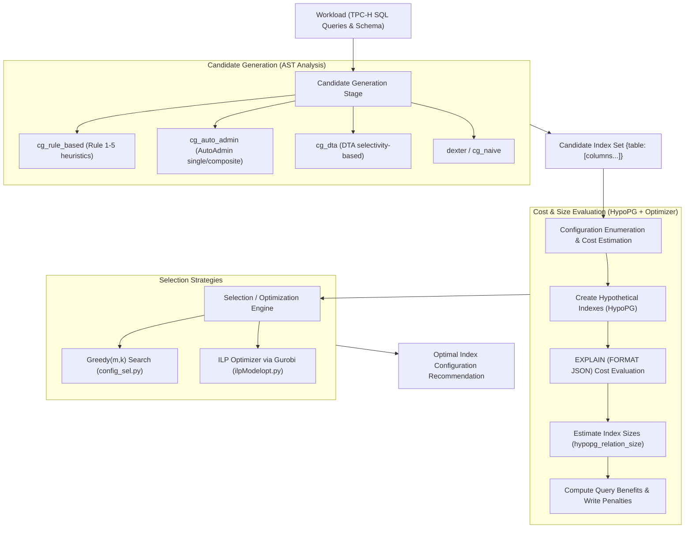

# Automatic Index Selector — Project Architecture & Structure Explanation

## 1. Overview

**Automatic Index Selector** is a modular database physical design tuning system built for PostgreSQL. Its primary goal is to automatically recommend an optimal set of secondary indexes for a given SQL workload (queries and write/update statements) under a physical storage budget, balancing **query performance speedups** against **index maintenance / write penalties**.

The project implements and combines state-of-the-art database indexing algorithms (such as Microsoft AutoAdmin, Microsoft DTA, Rule-Based CIKM heuristics, Dexter, and Greedy($m,k$)) alongside an Integer Linear Programming (ILP) formulation solved via Gurobi.

---

## 2. Directory Structure Tree

```
Automatic_Index_Selector/
├── config.toml                 # Configuration file selecting active pipeline modules
├── pyproject.toml              # Build & package configuration (setuptools, pytest)
├── requirements.txt            # Python dependencies (gurobipy, psycopg2, sqlglot, etc.)
├── README.md                   # Project README
├── explaination.md             # Complete architectural & structure documentation (this file)
│
├── src/
│   └── auto_index_selector/    # Main package source code
│       ├── __init__.py
│       ├── __main__.py         # Pipeline entry point & dynamic module loader
│       │
│       ├── Workload/           # Workload & database schema definitions
│       │   ├── __init__.py
│       │   ├── tpchWorkload.py # TPC-H 22-query workload loader and table schema
│       │   └── tpcdsWorkload.py# TPC-DS workload loader (scaffold)
│       │
│       ├── CandidateGeneration/# Candidate index generation algorithms
│       │   ├── __init__.py
│       │   ├── cg_rule_based.py# AST-based multi-attribute heuristic rules (CIKM)
│       │   ├── cg_auto_admin.py# Chaudhuri & Narasayya (SIGMOD'97) AutoAdmin approach
│       │   ├── cg_dta.py       # Microsoft Database Tuning Advisor (DTA) strategy
│       │   ├── cg_naive.py     # Naive candidate generator
│       │   └── dexter.py       # Dexter index advisor integration / table-column combinations
│       │
│       ├── ConfigEnumeration/  # Configuration search space generators
│       │   ├── __init__.py
│       │   └── configGeneration.py # Cartesian / cross-product configuration generation
│       │
│       ├── ConfigSelection/    # Configuration selection strategies
│       │   ├── __init__.py
│       │   ├── config_sel.py   # Greedy(m,k) algorithm and subset configuration pruning
│       │   ├── cs_greedy.py    # Standalone greedy selection module
│       │   ├── cs_drop.py      # Drop-heuristic configuration selection scaffold
│       │   └── cs_dta.py       # DTA configuration selection scaffold
│       │
│       ├── CostEstimator/      # Cost & storage estimation via PostgreSQL + HypoPG
│       │   ├── __init__.py
│       │   └── costEstimator.py# HypoPG interface, optimizer cost queries, parallel cost estimation
│       │
│       └── ILPSolver/          # Integer Linear Programming optimization models
│           ├── __init__.py
│           ├── ilpModel.py     # Standard 0-1 ILP formulation (Gurobi)
│           └── ilpModelopt.py  # Memory-optimized sparse ILP formulation for large state spaces
│
├── workload/                   # SQL benchmark workload files
│   └── queries_tpch/           # TPC-H SQL query files (q1.sql to q22.sql)
│       ├── gen_query_duckdb.py # DuckDB script to generate/export TPC-H SQL files
│       ├── q1.sql ... q22.sql  # 22 standard TPC-H analytical benchmark queries
│
└── tests/                      # Unit & integration tests
    ├── __init__.py
    ├── test_candidateSelection.py # Tests for AutoAdmin candidate generation
    ├── test_rulecs.py          # Tests for rule-based candidate generation
    ├── testCofigGeneration.py  # Tests for configuration enumeration
    ├── testCostEstimator.py    # Tests for HypoPG cost & storage estimation
    ├── testDexter.py           # Tests for Dexter integration
    ├── testWorkoad.py          # Tests for workload loading
    └── test_ilp.py             # Benchmarking ILP solver runtime scaling with Gurobi
```

---

## 3. Component Details & Module Responsibilities

### 3.1 Pipeline Orchestrator (`src/auto_index_selector/__main__.py` & `config.toml`)
- **`config.toml`**: Defines which component to plug into the pipeline stages (`candidate_generation`, `config_selection`, `workload`).
- **`__main__.py`**: Dynamically imports the chosen modules based on `config.toml` using `importlib`, connects to PostgreSQL (via `psycopg2` and `.env` credentials), and executes the end-to-end index selection pipeline:
  1. Load workload $W$ and database schema.
  2. Generate candidate indexes using the configured candidate generator.
  3. Enumerate and select the optimal index configuration using greedy search or ILP.

---

### 3.2 Workload Module (`src/auto_index_selector/Workload/`)
- **`tpchWorkload.py`**:
  - Contains complete column-level definitions for the 8 TPC-H tables: `region`, `nation`, `part`, `supplier`, `partsupp`, `customer`, `orders`, `lineitem`.
  - `getWorkload()` reads `.sql` query files from `workload/queries_tpch/` and returns the queries along with `tpch_schema`.
- **`tpcdsWorkload.py`**:
  - Skeleton module for loading the TPC-DS schema and query workload.

---

### 3.3 Candidate Generation (`src/auto_index_selector/CandidateGeneration/`)
Generates a bounded set of promising single-column and multi-column (composite) candidate indexes from the SQL workload:

1. **`cg_rule_based.py`**:
   - Uses `sqlglot` to parse SQL queries into Abstract Syntax Trees (ASTs).
   - Extracts join columns ($J$), equality filter columns ($EQ$), range filter columns ($RANGE$), and ordering columns ($O$, `GROUP BY` / `ORDER BY`).
   - Applies composite index generation rules:
     - **Rule 1**: Single-column candidates from $J \cup EQ \cup RANGE$.
     - **Rule 2**: Multi-column index on $O$ if all columns belong to the same table.
     - **Rule 3**: Multi-column indexes on join predicates sharing a table.
     - **Rule 4**: Combinations combining join, equality, and range columns (e.g., $EQ$ + $RANGE$, $J$ + $EQ$, $J$ + $RANGE$).
     - **Rule 5**: Width-expansion heuristic up to `max_attrs`.
2. **`cg_auto_admin.py`**:
   - Implements Chaudhuri & Narasayya's *AutoAdmin* candidate selection approach.
   - Extracts single indexable columns from each query and evaluates per-query index benefit using optimizer cost reductions.
3. **`cg_dta.py`**:
   - Implements Microsoft *Database Tuning Advisor* (DTA) candidate construction rules.
   - Operates on individual queries and builds composite selection candidates (equality columns ordered by selectivity + at most one trailing range column) and join-leading candidates.
4. **`cg_naive.py` & `dexter.py`**:
   - Interfaces with the `dexter` indexing tool via PostgreSQL `pg_stat_statements` or enumerates all user table column combinations up to `max_width`.

---

### 3.4 Configuration Enumeration & Selection (`src/auto_index_selector/ConfigSelection/` & `ConfigEnumeration/`)
Indexes interact with one another (e.g., index subsumption, interaction on join paths). This stage forms index subsets (configurations) and chooses the best configuration:

1. **`config_sel.py`**:
   - **`getRelevantIndexes(tables, candidate_indexes)`**: Filters candidate indexes to only those appearing on tables referenced by query $q$ ($I_q$).
   - **`enumerateSubsets(relevant, mode="pairs"|"all")`**: Generates configurations of single indexes and index pairs (quadratic search) or power set configurations.
   - **`greedyMK(conn, W, candidate_dict, m, k)`**: Implements the **Greedy($m,k$)** algorithm:
     - *Phase 1 (Exhaustive Seed)*: Searches all index subsets of size $\le m$ to capture non-linear index interactions.
     - *Phase 2 (Greedy Expansion)*: Greedily adds one index at a time that provides the maximum marginal workload cost reduction until $k$ indexes are reached or no further cost reduction is possible.
2. **`configGeneration.py`**:
   - Generates cross-product configurations across tables accessed by workload queries.

---

### 3.5 Cost & Storage Estimator (`src/auto_index_selector/CostEstimator/`)
- **`costEstimator.py`**:
  - Leverages PostgreSQL's **HypoPG** extension to create hypothetical (virtual) indexes without building physical B-Trees on disk.
  - **`getQueryCost(conn, query)`**: Executes `EXPLAIN (FORMAT JSON)` on PostgreSQL to retrieve the optimizer's estimated plan execution cost (`Total Cost`).
  - **`estimateConfigurationCost(conn, query, configuration)`**: Evaluates query cost baseline ($Cost_{init}$) vs cost with hypothetical indexes created ($Cost_{fin}$).
  - **`estimateWorkloadCost(...)`**: Evaluates costs across the entire workload. Features a multiprocessing pool (`multiprocessing.Pool`) that distributes `EXPLAIN` calls concurrently across worker processes with session-isolated HypoPG connections.
  - **`storageEstimate(conn, indexSet)`**: Estimates the disk footprint of each candidate index using `hypopg_relation_size`.
  - **`estimateWorkloadCostUpdate(conn, W, configurations)`**: Interface for quantifying update/write penalties incurred when modifying indexed tables.

---

### 3.6 Integer Linear Programming (ILP) Solver (`src/auto_index_selector/ILPSolver/`)
Finds the mathematically optimal index configuration by formulating the selection as a 0-1 Integer Linear Program:

- **Formulation**:
  - **Binary Variables**:
    - $y_j \in \{0, 1\}$: 1 if candidate index $j$ is created, 0 otherwise.
    - $x_{ik} \in \{0, 1\}$: 1 if query $i$ utilizes configuration $k$, 0 otherwise.
  - **Objective Function**:
    $$\max \sum_{i} \sum_{k} \text{benefit}_{ik} \cdot x_{ik} - \sum_{j} f_j \cdot y_j$$
    where:
    - $\text{benefit}_{ik} = \text{CostInit}_i - \text{CostFinal}_{ik}$ (query runtime speedup).
    - $f_j = \sum_{l} \text{CostUpdate}_{lj}$ (write penalty for maintaining index $j$ across update statements).
  - **Constraints**:
    1. **At most one configuration per query**:
       $$\forall i, \quad \sum_{k} x_{ik} \le 1$$
    2. **Configuration enablement**: Configuration $k$ can only be used if all its constituent indexes $j \in \text{config}_k$ are built:
       $$\forall i, k, \forall j \in \text{config}_k, \quad x_{ik} \le y_j$$
    3. **Storage budget constraint**:
       $$\sum_{j} y_j \cdot \text{Size}_j \le \text{StorageBudget}$$
- **`ilpModel.py`**: Standard dense Gurobi model.
- **`ilpModelopt.py`**: Memory-optimized sparse formulation that only creates $x_{ik}$ decision variables for configurations that provide non-zero benefit for query $i$, avoiding state explosion on large workloads.

---

## 4. End-to-End Pipeline Workflow



---

## 5. File Inventory & Purpose

| File Path | Description / Role |
|:---|:---|
| `config.toml` | Pipeline configuration specifying active candidate generation, config selection, and workload modules |
| `pyproject.toml` | Project packaging, dependency definitions, and pytest settings |
| `requirements.txt` | Core Python dependencies (`gurobipy`, `psycopg2-binary`, `sqlglot`, `pyprojroot`, etc.) |
| `src/auto_index_selector/__main__.py` | Main entry point that parses `config.toml` and executes the pipeline |
| `src/auto_index_selector/Workload/tpchWorkload.py` | TPC-H 22-query workload loader and relational schema metadata |
| `src/auto_index_selector/Workload/tpcdsWorkload.py` | TPC-DS workload loader scaffold |
| `src/auto_index_selector/CandidateGeneration/cg_rule_based.py` | SQLGlot AST query analyzer applying multi-attribute rules (Rules 1-5) |
| `src/auto_index_selector/CandidateGeneration/cg_auto_admin.py` | AutoAdmin candidate generation and per-query benefit evaluation |
| `src/auto_index_selector/CandidateGeneration/cg_dta.py` | Microsoft DTA candidate selection algorithm |
| `src/auto_index_selector/CandidateGeneration/cg_naive.py` | Basic candidate generation wrapper |
| `src/auto_index_selector/CandidateGeneration/dexter.py` | Dexter integration and combinatoric index candidate generation |
| `src/auto_index_selector/ConfigEnumeration/configGeneration.py` | Cross-product configuration generator |
| `src/auto_index_selector/ConfigSelection/config_sel.py` | Greedy($m,k$) selection algorithm and subset enumeration |
| `src/auto_index_selector/CostEstimator/costEstimator.py` | HypoPG integration, optimizer cost extraction, and parallel execution |
| `src/auto_index_selector/ILPSolver/ilpModel.py` | Standard Gurobi 0-1 ILP solver implementation |
| `src/auto_index_selector/ILPSolver/ilpModelopt.py` | Memory-optimized sparse Gurobi ILP solver |
| `workload/queries_tpch/` | Contains standard TPC-H SQL queries (`q1.sql` - `q22.sql`) |
| `tests/` | Unit and integration test suite covering each stage of the pipeline |

---

## 6. How to Run

### Prerequisites
1. PostgreSQL instance with the `hypopg` extension installed:
   ```sql
   CREATE EXTENSION IF NOT EXISTS hypopg;
   ```
2. Gurobi Optimizer license installed for ILP solving.
3. Python 3.10+ virtual environment.

### Environment Setup
Create a `.env` file in the project root:
```env
DB_NAME=tpch
DB_USER=postgres
DB_PASSWORD=your_password
DB_HOST=localhost
DB_PORT=5432
```

### Install Dependencies
```bash
pip install -r requirements.txt
pip install -e .
```

### Run the Pipeline
```bash
python -m auto_index_selector
```
