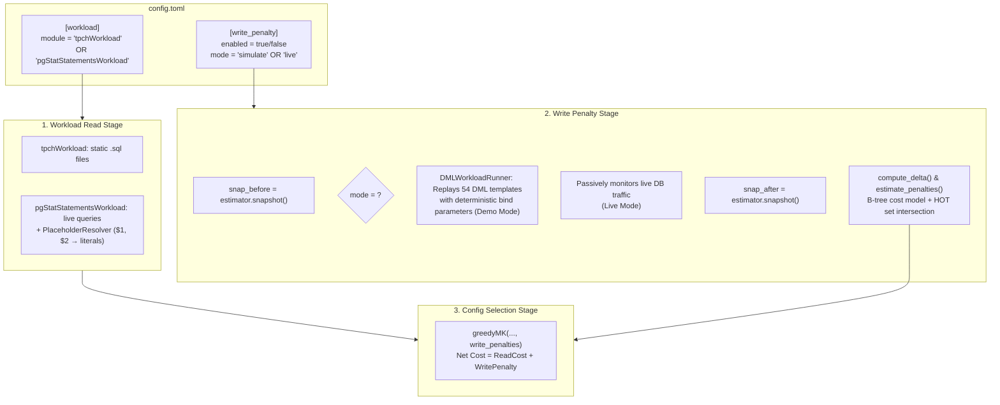

# Write Penalty & Workload Integration Guide

## 1. Overview & Purpose

This document explains the integration of the **B-tree Write Penalty Model**, the **`advisor_write_stats` PostgreSQL extension**, and the **Dual-Mode (Live vs. Demo/Simulation) Workload Framework** into the **Automatic Index Selector** pipeline.

---

## 2. Architecture & Pluggable Options



---

## 3. What Was Added / Modified

```
Automatic_Index_Selector/
├── config.toml                                                       # [MODIFIED] Added [write_penalty] & dual-mode options
├── src/
│   └── auto_index_selector/
│       ├── __main__.py                                               # [MODIFIED] Wired dual-mode execution & live workload loader
│       ├── ConfigSelection/
│       │   └── config_sel.py                                         # [MODIFIED] Updated greedyMK to factor in write maintenance
│       ├── CostEstimator/
│       │   ├── costEstimator.py                                      # [MODIFIED] Filled estimateWorkloadCostUpdate
│       │   └── write_penalty_estimator.py                            # [NEW] Self-contained B-tree write penalty engine
│       └── Workload/
│           ├── dml_runner.py                                         # [NEW] DML Workload Replay Engine + ParameterGenerator
│           ├── pgStatStatementsWorkload.py                           # [NEW] Live Workload Loader + PlaceholderResolver
│           └── tpchWorkload.py                                       # [EXISTING] Static TPC-H query loader
├── workload/sql/dml/*.sql                                            # [NEW] 54 standard TPC-H DML templates
├── integration.md                                                    # [NEW] This comprehensive guide
└── explaination.md                                                   # [EXISTING] Project architecture reference
```

---

## 4. Operational Modes Explained

### Mode A: Demo / Simulation Mode (100% Self-Contained)
- **Settings in `config.toml`**:
  ```toml
  [workload]
  module = "tpchWorkload"

  [write_penalty]
  enabled = true
  mode = "simulate"
  simulation_rounds = 50
  simulation_mode = "random"
  simulation_timeout = 30       # Per-statement timeout in seconds (matching MTP 30s)
  ```
- **What happens**:
  1. `snap_before` is captured.
  2. Sets `SET statement_timeout = 30000;` on the simulation connection.
  3. `DMLWorkloadRunner` executes 50 parameterized DML operations (INSERT, UPDATE, DELETE) against PostgreSQL. If a slow statement exceeds 30s, it catches the timeout, rolls back the transaction, logs `TIMEOUT (>30s): {query_name}`, and continues to the next DML.
  4. Resets `SET statement_timeout = 0;` after simulation completes.
  5. `advisor_write_stats` intercepts all UPDATEs in shared memory.
  6. `snap_after` is captured, delta is computed, and candidate indexes on updated columns incur write penalties.
  7. `greedyMK` selects indexes only if read reduction exceeds write maintenance.

### Mode B: Live Workload Mode (Zero Synthetic Queries)
- **Settings in `config.toml`**:
  ```toml
  [workload]
  module = "pgStatStatementsWorkload"

  [write_penalty]
  enabled = true
  mode = "live"
  window_duration_seconds = 0   # or e.g. 60 to observe for 1 minute
  ```
- **What happens**:
  1. `snap_before` is captured.
  2. No artificial `statement_timeout` is imposed; real production queries execute normally.
  3. `pgStatStatementsWorkload` extracts top executing read queries from `pg_stat_statements` and uses `PlaceholderResolver` to substitute `$1, $2` with typed literals.
  4. `snap_after` is captured from actual database activity.
  5. What-if costs and penalties reflect 100% real live production traffic.

---

## 5. Technical Innovations

### 5.1 PlaceholderResolver for `pg_stat_statements`
When `pg_stat_statements` normalizes queries like:
```sql
SELECT * FROM customer WHERE c_custkey = $1 AND c_acctbal > $2 AND c_mktsegment = $3 LIMIT $4;
```
Direct `EXPLAIN` fails. The `PlaceholderResolver` identifies column types and transforms it into:
```sql
SELECT * FROM customer WHERE c_custkey = 1 AND c_acctbal > 1.0 AND c_mktsegment = 'A' LIMIT 10;
```
Allowing PostgreSQL's query planner and HypoPG to plan the query and cost hypothetical indexes accurately.

### 5.2 Column-Set Multi-Column Update Tracking
Using `advisor_get_column_set_stats()` from the C extension:
- An update on `(A, B)` is counted for index `(A,)`.
- An update on `(A, B)` is counted for index `(B,)`.
- An update on `(A, B)` is counted **once per row** for composite index `(A, B)` (avoiding double-counting).
- An update on `(A, B)` is charged **0** for index `(C,)` (HOT Heap-Only Tuple optimization).

---

## 6. How to Run

### Step 1: Pre-load the Extension in PostgreSQL
In `postgresql.conf`:
```ini
shared_preload_libraries = 'advisor_write_stats,pg_stat_statements'
```
Restart PostgreSQL:
```bash
sudo systemctl restart postgresql
```

### Step 2: Configure `config.toml`
Set your desired mode in `config.toml`:
```toml
[candidate_generation]
module = "cg_rule_based"

[config_selection]
module = "cs_greedy"

[workload]
module = "tpchWorkload"   # or "pgStatStatementsWorkload"

[write_penalty]
enabled = true
mode = "simulate"         # or "live"
write_scale = 1.0
simulation_rounds = 50
```

### Step 3: Run the Selector
```bash
python -m auto_index_selector
```
